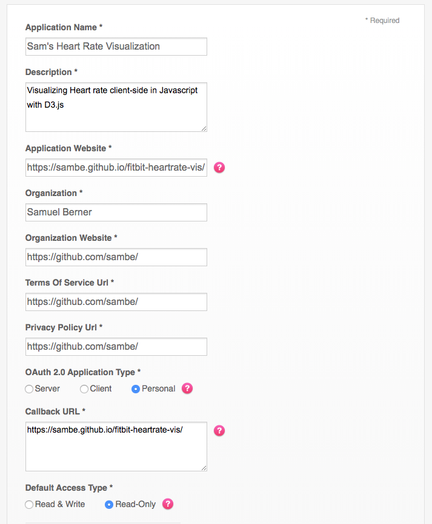

# Visualizing Heartrate together with Sleep Zones
Using D3.js and the FitBit API

Hosted by Github: https://sambe.github.io/yourgithubname.github.io/fitbit-heartrate-vis/

See below, on how to set it up, so you can use it on your own FitBit data.

## Setup

1. Fork this repo
   to get your own copy hosted at https://_yourgithubname_.github.io/fitbit-heartrate-vis/
   (replace _yourgithubname_ with your actual github user name)
2. Get a personal FitBit API client code:
   1. Go to https://dev.fitbit.com/apps and log in
   2. Choose the tab "REGISTER AN APP"
   3. Fill in the form:
      
      The following fields are particularly important:
      * **Callback URL**: This needs to be the URL from point 1
      * **OAuth 2.0 Application Type**: This needs to be "Personal" to get access to your own intraday heart rate data
      * **Default Access Type**: "Read-Only" is sufficient
   4. After saving you will get a "Client ID". Keep this one for step 3.
3. Open your URL from point 1
   1. When prompted, enter your Client ID
   2. next you will get the login link on the page, click it and log in
   3. Congratulations, you should now see the visualization of your FitBit sleep and heart rate data!

Any questions? Please let me know about them in the "Issues" tab of this repo.
